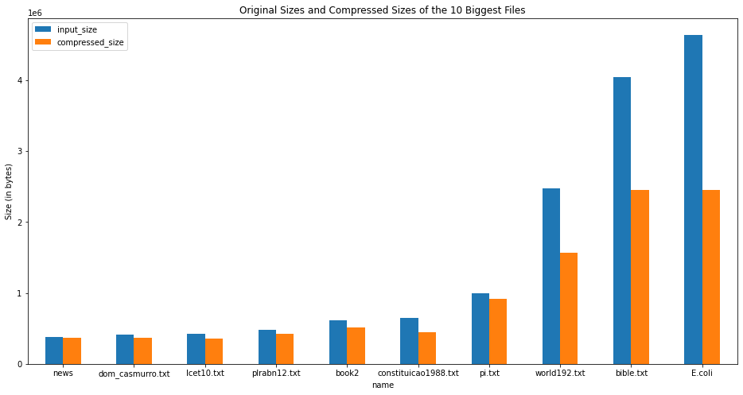

# lz78

This repository provides a simple implementation of the [lz78 algorithm](https://en.wikipedia.org/wiki/LZ77_and_LZ78),
an algorithm for lossless data compression that was created in 1978 by Abraham Lempel and Jacob Ziv. The project was developed as an [assignment](https://github.com/MvKaio/lz78/blob/main/inputs/specification/tp1.txt) for a course on algorithms @ UFMG, 
with the goal of exploring an application of the trie data structure, which is a useful tool in string algorithms that involve searching for patterns
within a text, such as in string matching.

## How to use?

To compile the project, run `make`. An executable named `lz78` should be created in the root folder of the repository.
This executable allows you to compress or decompress a file and store the result in an output file.
The usage is as follows:

Compression: `./lz78 -c <input_file> [-o <output_file>]`

Decompression: `./lz78 -x <input_file> [-o <output_file>]`

## Example Input Files

Inside the `inputs` folder, there are some sample files used to test the performance of the implementation. The specification subfolder contains example files that were provided together with the assignment.
The other subfolders contain the data available in the [Canterbury Corpus](https://corpus.canterbury.ac.nz/):
a set of input files designed to compare lossless data compression algorithms, and to highlight some cases in which the
compression is usually good or bad. A [detailed description](https://corpus.canterbury.ac.nz/descriptions/) of each test
file is also available.

Running `make compress` will compress every file in the `inputs` folder, 
storing the results in the `outputs` folder, grouped accordingly to their input set.

## Results

The following table shows the result achieved in each of the input tests. The input and compressed sizes are measured in bytes.

| **Name**              | a.txt    | random.txt | alphabet.txt | aaa.txt  | paper5   | paper4  | paper6   | progc   | paper3   | paper1   | paper2   | progp   | news    | bib     | progl   | book2   | xargs.1  | grammar.lsp | fields.c | cp.html  | asyoulik.txt | alice29.txt | plrabn12.txt | lcet10.txt | world192.txt | bible.txt | E.coli  | pi.txt  | tp1.txt       | os_lusiadas.txt | dom_casmurro.txt | constituicao1988.txt |
|-----------------------|----------|------------|--------------|----------|----------|---------|----------|---------|----------|----------|----------|---------|---------|---------|---------|---------|----------|-------------|----------|----------|--------------|-------------|--------------|------------|--------------|-----------|---------|---------|---------------|-----------------|------------------|----------------------|
| **Testset**           | artificl | artificl   | artificl     | artificl | calgary  | calgary | calgary  | calgary | calgary  | calgary  | calgary  | calgary | calgary | calgary | calgary | calgary | cantrbry | cantrbry    | cantrbry | cantrbry | cantrbry     | cantrbry    | cantrbry     | cantrbry   | large        | large     | large   | misc    | specification | specification   | specification    | specification        |
| **Input Size**        | 1        | 100000     | 100000       | 100000   | 11954    | 13286   | 38105    | 39611   | 46526    | 53161    | 82199    | 49379   | 377109  | 111261  | 71646   | 610856  | 4227     | 3721        | 11150    | 24603    | 125179       | 152089      | 481861       | 426754     | 2473400      | 4047392   | 4638690 | 1000000 | 6550          | 344538          | 409610           | 651790               |
| **Compressed Size**   | 10       | 170945     | 11340        | 2235     | 17050    | 18245   | 45745    | 47295   | 54525    | 60835    | 86685    | 49060   | 367175  | 107295  | 68120   | 512560  | 6720     | 5355        | 13925    | 28425    | 127955       | 145460      | 423550       | 360420     | 1566530      | 2454030   | 2455550 | 916445  | 9980          | 325380          | 370455           | 445245               |
| **Compression Ratio** | 0.1      | 0.584983   | 8.81834      | 44.7427  | 0.701114 | 0.7282  | 0.832987 | 0.83753 | 0.853297 | 0.873856 | 0.948249 | 1.0065  | 1.02706 | 1.03696 | 1.05176 | 1.19177 | 0.629018 | 0.694865    | 0.800718 | 0.865541 | 0.978305     | 1.04557     | 1.13767      | 1.18405    | 1.5789       | 1.64928   | 1.88906 | 1.09117 | 0.656313      | 1.05888         | 1.10569          | 1.46389              |

We notice that the results are satisfactory for a prototypical implementation of the method, having achieved reasonable
compression rates, especially when the input is large. The figure below shows the sizes before and after the compression
for the $10$ largest files in the dataset.

Another interesting remark is that the algorithm has better results when there is a lot of repetition in the input file. 
The files `aaa.txt` (which is the letter `a` repeated $10^5$ times), and `E.coli` (which is the genome of the E. Coli 
bacterium) showcase this.

On another note, this implementation couldn't even compress some of the files, especially the ones that don't have 
such large repeated patterns, as showcased by the `random.txt` input file. It is important to note that there is 
room for improvement in the implementation, as it'll be discussed in the next section, but some of the limitations 
are inherent to the method.

## Implementation Details

The `encoder.cpp` file provides the core methods of the implementation: `encode` and `decode`. The `lz78.cpp` file is
responsable for parsing the command line options and calling `encode` or `decode` depending on the use case.

The encoding proccess generates a sequence of tokens from the input string. Each token is made up of an integer identifier
and an associated character. In essence, this sequence represents the compressed form of the data, but different
implementations can be find creative ways on how to store it in the output file.

For instance, a naive way to do this is to encode the token identifiers in character form (as it is the easiest form of 
decompressing them), but this wastes a lot of space and doesn't achieve compression. Instead, we used $4$ bytes to 
represent each identifier, assuming they will fit in an integer and write their raw bytes into the output file.
The function (`write_to_a_file`) that writes the list of tokens following this convention, is very succint.

The decoding proccess is very similar: we read the representation of list of tokens from the compressed file, reconstructing
the original input string while reading.

An important part of the compression and decompression progress is the data structure used to store the tokens, working as
a dictionary. The file `trie.cpp` provides this implementation. Given the close correspondence of the token identifiers and
the trie internal nodes, I decided to implement the structure using a `std::vector`, as opposed to using pointers (which is
more usual). The implementation is very simple, providing the ability to search for an identifier, adding a new token, and
recovering a prefix.

A more clever strategy I have discussed with some colleagues consists in figuring out the minimum number of _bits_ needed
to represent the tokens and using this amount of _bits_ to write the integers. This implementation is more intricated, 
as there isn't a familiar interface to writing raw _bits_ into a file. Thus, implementing this idea would require more 
_bit_ hacks, and was left to a future project.
